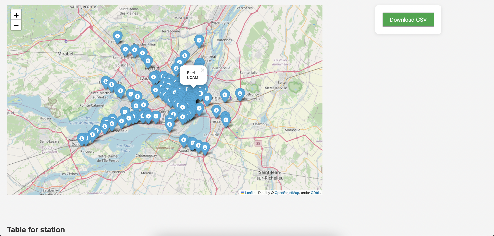
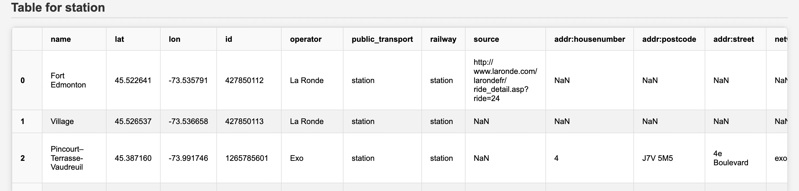

## OSM Downloader

This OSM downloader creates a CSV of nodes that exist in OSM for a certain bounding box.
ie: You can download the information for all train stations in a certain rectangular area drawn on a map.

#### Running steps:

1) Clone and run `pip install requirements.txt`
2) Run flask app using `flask --app app run --debug`
3) Select the bounding box by ticking "draw a rectangle" on the map and drawing the bounding box
   

4) Select the OSM node value (eg: station, dentist, shop, etc) and click submit
5) Browse the output markers on the map and the CSV result below. You can also download the CSV.
   

   
   
   

#### Tech used:

- Flask used as the framework for the web app
- Python for backend. Two approaches for downloading data from the [Overpass API](https://wiki.openstreetmap.org/wiki/Overpass_API#Quick_Start_(60_seconds):_for_Developers/Programmers), using either Python requests or OSMPythonTools.
- The first interactive map was created using JavsScript. I used some Stackoverflow and ChatGPT help to learn how to capture the bounding box and put it in a hidden HTML form.
- The second interactive map was created in Python using Folium
- CSS Styling is poor due to my limited frontend skills
